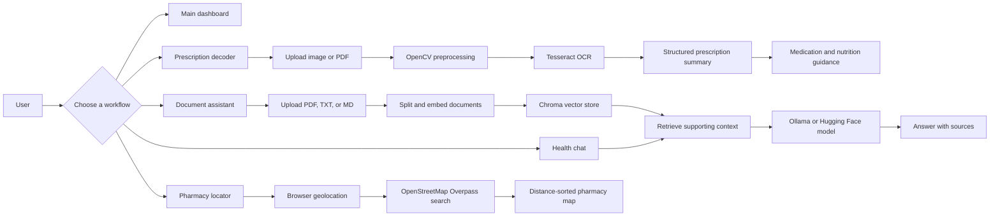

# ProMedic+

> An AI-powered healthcare companion for prescription decoding, medication guidance, document search, and pharmacy discovery.

[](https://www.python.org/)
[](https://streamlit.io/)
[](https://chainlit.io/)
[](#license)

ProMedic+ brings several healthcare workflows into one Python application. Users can upload a prescription, extract and structure its text, ask questions against trusted documents, receive general medication and nutrition guidance, and locate nearby pharmacies.

> **Important:** ProMedic+ provides general information and does not replace a qualified healthcare professional, diagnosis, or emergency care.

## Contents

- [What the application does](#what-the-application-does)
- [Application flow](#application-flow)
- [Features](#features)
- [Architecture](#architecture)
- [Project structure](#project-structure)
- [Requirements](#requirements)
- [Setup](#setup)
- [Run the interfaces](#run-the-interfaces)
- [Configuration](#configuration)
- [Data and privacy](#data-and-privacy)
- [Troubleshooting](#troubleshooting)
- [Maintainer](#maintainer)

## What the application does

ProMedic+ is organized around a simple flow:

1. **Start with a healthcare task.** Open the main dashboard, prescription decoder, document assistant, health chat, or pharmacy locator.
2. **Provide context.** Upload a prescription or supporting document, enter an optional patient profile, or allow location access for pharmacy search.
3. **Process the input.** OCR extracts text, the language model structures prescription details, and the RAG pipeline retrieves relevant document context.
4. **Review the result.** The application presents extracted medications, general nutrition guidance, answers with sources, or nearby pharmacy locations.
5. **Continue the conversation.** Use follow-up questions or add documents to improve the context used by the assistant.

## Application flow



## Features

### Prescription decoder

- Accepts prescription images and PDF files.
- Preprocesses images with OpenCV before OCR.
- Extracts English text with Tesseract.
- Identifies medication-like lines, dosage, and timing instructions.
- Uses the configured language model to produce a structured summary.
- Generates general nutrition and adherence guidance.
- Can optionally upload saved OCR records to Azure Blob Storage.

### Document assistant

- Loads the included WHO reference PDF and user-provided PDF, TXT, or Markdown files.
- Splits documents into overlapping chunks.
- Creates embeddings and stores them in ChromaDB.
- Retrieves relevant context with similarity search and multi-query retrieval.
- Answers questions with supporting source paths.

### Health chat

- Provides a conversational Streamlit interface.
- Shares prescription context and retrieved document context with the model when available.
- Supports a Chainlit chat interface through the same application logic.
- Keeps chat history in the active session.

### Pharmacy locator

- Requests browser geolocation permission.
- Queries nearby pharmacies through OpenStreetMap Overpass.
- Calculates distance from the user’s location.
- Displays pharmacy markers and details on an interactive Folium map.

## Architecture

| Layer | Implementation | Responsibility |
| --- | --- | --- |
| User interfaces | Streamlit, Chainlit | Dashboards, uploads, chat, maps, and results |
| OCR pipeline | OpenCV, PyMuPDF, Tesseract, Pillow | Image cleanup and prescription text extraction |
| AI orchestration | LangChain, Ollama, Hugging Face | Prompting, model calls, embeddings, and retrieval |
| Knowledge store | ChromaDB | Persistent document embeddings and similarity search |
| Location services | Browser Geolocation, Overpass, Folium | Pharmacy discovery and map rendering |
| Optional storage | Azure Blob Storage | Remote storage for OCR records when configured |

## Project structure

```text
.
├── main.py                         # Main Streamlit dashboard
├── ocr.py                          # Prescription OCR and guidance workflow
├── app_streamlit.py                # RAG document assistant
├── app_chainlit.py                 # Streamlit and Chainlit chat workflow
├── pharmascysol.py                 # Pharmacy locator and map
├── model_provider.py               # Ollama and Hugging Face model adapters
├── rag.py                           # Retrieval helpers
├── requirements.txt                # Python dependencies
├── chainlit.md                     # Chainlit project instructions
├── data/
│   └── World-Health-Organization.pdf # Included reference document
├── notebooks/                      # OCR and handwriting experiments
└── .gitignore                      # Local environments, secrets, and generated data
```

Generated folders such as `venv/`, `.env`, Streamlit secrets, OCR records, uploaded documents, and `chroma_db/` are intentionally excluded from version control.

## Requirements

- Python 3.9 or newer
- Git
- Tesseract OCR installed and available at the path configured in `ocr.py`
- Ollama for local inference, or a Hugging Face API token for hosted inference
- A modern browser for Streamlit, Chainlit, uploads, and geolocation

## Setup

### 1. Clone the repository

```bash
git clone https://github.com/tejo1080p/ProMedic.git
cd ProMedic
```

### 2. Create a virtual environment

Windows PowerShell:

```powershell
python -m venv venv
.\venv\Scripts\Activate.ps1
```

macOS or Linux:

```bash
python -m venv venv
source venv/bin/activate
```

### 3. Install dependencies

```bash
python -m pip install --upgrade pip
pip install -r requirements.txt
```

### 4. Choose an AI provider

For local inference, install Ollama and pull the default models:

```bash
ollama pull llama3.2
ollama pull nomic-embed-text
```

For Hugging Face inference, configure the variables described below in your deployment environment. Never commit tokens or secret files.

## Run the interfaces

Run each interface from the repository root in its own terminal when needed.

| Workflow | Command | Purpose |
| --- | --- | --- |
| Main dashboard | `streamlit run main.py` | Home screen and navigation |
| Prescription decoder | `streamlit run ocr.py` | OCR, structured prescription data, and guidance |
| Document assistant | `streamlit run app_streamlit.py` | RAG questions over reference and uploaded documents |
| Health chat | `streamlit run app_chainlit.py` | Conversational Streamlit health assistant |
| Chainlit chat | `chainlit run app_chainlit.py` | Browser-based Chainlit conversation |
| Pharmacy locator | `streamlit run pharmascysol.py` | Nearby pharmacy search and map |

Streamlit normally opens at `http://localhost:8501`. Chainlit normally opens at `http://localhost:8000`.

## Configuration

The application defaults to local Ollama inference:

```text
LLM_PROVIDER=ollama
LLM_MODEL=llama3.2
EMBEDDING_MODEL=nomic-embed-text
```

For Hugging Face inference, set:

```text
LLM_PROVIDER=huggingface
LLM_MODEL=Qwen/Qwen2.5-7B-Instruct
EMBEDDING_MODEL=sentence-transformers/all-MiniLM-L6-v2
HF_TOKEN=your_token
HF_BASE_URL=https://router.huggingface.co/v1
```

Optional Azure OCR-record storage:

```text
AZURE_STORAGE_CONNECTION_STRING=your_connection_string
AZURE_STORAGE_CONTAINER=promedic-records
```

Set these values through your shell, deployment settings, or a local secret manager. Do not commit `.env`, Streamlit secrets, API tokens, connection strings, patient records, or generated vector databases.

## Data and privacy

- Uploaded documents and OCR records are local application data unless Azure Blob Storage is explicitly configured.
- The local Chroma index is generated at runtime and is not part of the repository.
- Do not use real patient information during development unless you have the required authorization and protections.
- Review model output and medication details with a qualified professional before acting on them.

## Troubleshooting

**The model cannot be reached**

- Confirm Ollama is running.
- Check that the configured model has been pulled.
- If using Hugging Face, verify `LLM_PROVIDER`, `LLM_MODEL`, `EMBEDDING_MODEL`, and `HF_TOKEN`.

**OCR returns little or no text**

- Use a clear, well-lit image.
- Confirm Tesseract is installed at the path in `ocr.py`.
- Prefer a high-resolution scan and keep the prescription flat.

**The document assistant has no knowledge base**

- Confirm `data/World-Health-Organization.pdf` exists.
- Upload at least one supported PDF, TXT, or Markdown document.
- Delete the local `chroma_db/` directory and restart if the embedding model was changed.

**The pharmacy map is empty**

- Allow browser location access.
- Confirm the browser can access the network.
- Overpass results depend on OpenStreetMap coverage and service availability.

## Maintainer

**Tejo Gudala**<br>
GitHub: [@tejo1080p](https://github.com/tejo1080p)<br>
Project: [ProMedic](https://github.com/tejo1080p/ProMedic)

## License

This repository is provided for educational and project use. Add a project-specific license before distributing it as an open-source package.
